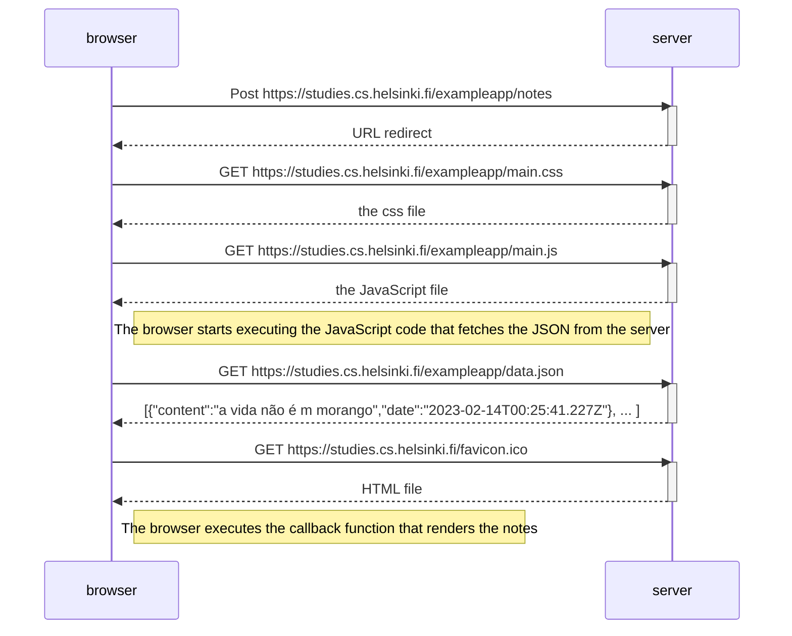

```mermaid
  sequenceDiagram
    participant browser
    participant server
    
    browser->>server: Post https://studies.cs.helsinki.fi/exampleapp/notes
    activate server
    server-->>browser: URL redirect
    deactivate server
    
    browser->>server: GET https://studies.cs.helsinki.fi/exampleapp/main.css
    activate server
    server-->>browser: the css file
    deactivate server
    
    browser->>server: GET https://studies.cs.helsinki.fi/exampleapp/main.js
    activate server
    server-->>browser: the JavaScript file
    deactivate server
    
    Note right of browser: The browser starts executing the JavaScript code that fetches the JSON from the server
    
    browser->>server: GET https://studies.cs.helsinki.fi/exampleapp/data.json
    activate server
    server-->>browser: [{"content":"a vida não é m morango","date":"2023-02-14T00:25:41.227Z"}, ... ]
    deactivate server    

    browser->>server: GET https://studies.cs.helsinki.fi/favicon.ico
    activate server
    server-->>browser: HTML file
    deactivate server  

    Note right of browser: The browser executes the callback function that renders the notes 
```