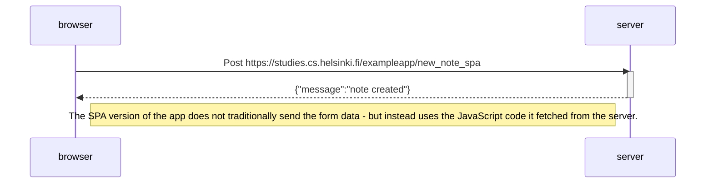

```mermaid
  sequenceDiagram
    participant browser
    participant server
    
    browser->>server: Post https://studies.cs.helsinki.fi/exampleapp/new_note_spa
    activate server
    server-->>browser: {"message":"note created"}
    deactivate server     

    Note right of browser: The SPA version of the app does not traditionally send the form data - but instead uses the JavaScript code it fetched from the server.
```